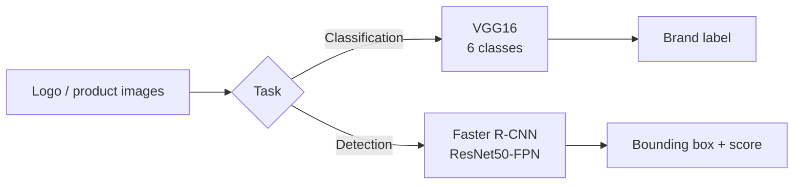

<div align="center">

# 🥤 DL Drink Logo

**Deep Learning pipeline for beverage brand logo recognition & detection**

[](https://www.python.org/)
[](https://www.tensorflow.org/)
[](https://pytorch.org/)
[](https://jupyter.org/)
[](https://colab.research.google.com/)
[](https://github.com/starduong/DL_Drink_Logo)
[](#)

[Introduction](#-introduction) ·
[Features](#-features) ·
[Quick Results](#-quick-results) ·
[Dataset](#-dataset) ·
[Structure](#-project-structure) ·
[Installation](#-installation) ·
[Usage](#-usage-guide) ·
[Evaluation](#-model-evaluation) ·
[Data Collection](#-data-collection) ·
[Contributing](#-contributing)

</div>

---

## 📑 Table of Contents

| #   | Section                                | Link                                       |
| --- | -------------------------------------- | ------------------------------------------ |
| 1   | Introduction                           | [#-introduction](#-introduction)           |
| 2   | Features                               | [#-features](#-features)                   |
| 3   | Quick Results (Demo & Learning Curves) | [#-quick-results](#-quick-results)         |
| 4   | Dataset                                | [#-dataset](#-dataset)                     |
| 5   | Project Structure                      | [#-project-structure](#-project-structure) |
| 6   | Installation                           | [#-installation](#-installation)           |
| 7   | Usage Guide                            | [#-usage-guide](#-usage-guide)             |
| 8   | Model Evaluation                       | [#-model-evaluation](#-model-evaluation)   |
| 9   | Data Collection                        | [#-data-collection](#-data-collection)     |
| 10  | Contributing                           | [#-contributing](#-contributing)           |

---

## 🎯 Introduction

**DL Drink Logo** is an end-to-end Deep Learning project for **beverage brand logos**, built around two complementary tasks:

| Task       | Problem                                  | Model                      | Framework             |
| ---------- | ---------------------------------------- | -------------------------- | --------------------- |
| **Task 1** | Brand classification (6 classes)         | VGG16 (train from scratch) | TensorFlow / Keras    |
| **Task 2** | Logo localization (Object Detection)     | Faster R-CNN ResNet50-FPN  | PyTorch / TorchVision |

The pipeline covers: **image collection** → **EDA** → **training** → **quantitative evaluation** → **visualization** (learning curves, confusion matrix, detection grid, out-of-sample inference).

> Both models are trained **without pretrained weights** (`weights=None`) to evaluate learning from scratch on the beverage logo domain.

---

## ✨ Features

- **Task 1 — Classification**
  - 6 labels: `7up`, `coca`, `fanta`, `pepsi`, `red_bull`, `sprite`
  - VGG16 + AdamW, callbacks (EarlyStopping, ReduceLROnPlateau, ModelCheckpoint)
  - Reports: accuracy, precision, recall, F1, confusion matrix, per-class metrics

- **Task 2 — Detection**
  - Pascal VOC XML, class `logo` (background + logo)
  - Faster R-CNN + Albumentations augmentation
  - Mixed precision, gradient clipping, custom training loop
  - Metrics: mAP@50, mAP@[50:95], IoU, GT vs Prediction visualization

- **Data pipeline**
  - Multi-source logo crawling script (DuckDuckGo, Selenium)
  - Dedicated dataset analysis notebooks per task

---

## 🖼️ Quick Results

The section below lets viewers grasp results **directly from the README** without opening a notebook.

### Task 1 — VGG16 Brand Classification

<table>
<tr>
<td width="50%">

**Learning Curves** — Loss, Accuracy, Learning Rate (30 epochs)


</td>
<td width="50%">

**Demo Predictions** — Prediction grid (green = correct, red = wrong)


</td>
</tr>
</table>

| Metric            | Value              |
| ----------------- | ------------------ |
| Best Val Accuracy | **97.89%**         |
| Test Accuracy     | **96.95%**         |
| Test F1-Score     | **96.95%**         |
| Parameters        | 15,766,854         |
| Training time     | ~7 min (Colab T4) |

📓 Notebook: [`classification/VGG16_drink_logo_classify.ipynb`](classification/VGG16_drink_logo_classify.ipynb)

---

### Task 2 — Faster R-CNN Logo Detection

<table>
<tr>
<td width="50%">

**Learning Curves** — Train/Val Loss & LR Schedule


</td>
<td width="50%">

**Demo Detections** — Ground Truth (green) vs Prediction (red)


</td>
</tr>
</table>

| Metric          | Value                |
| --------------- | -------------------- |
| Best Val Loss   | **0.1488**           |
| mAP@50          | **92.48%**           |
| mAP@[50:95]     | **61.72%**           |
| Parameters      | 41,352,281           |
| Training time   | ~164 min (Colab T4) |

📓 Notebook: [`detection/FastRCNN_drink_logo_detection.ipynb`](detection/FastRCNN_drink_logo_detection.ipynb)

---

## 📊 Dataset

Root dataset: **`dataset_drink_brand_logo`** (split separately for classification and detection).

### Classification — 6 brands

| Class    |     Train |       Val |      Test |      Total |
| -------- | --------: | --------: | --------: | ---------: |
| 7up      |       918 |       196 |       198 |      1,312 |
| coca     |     2,515 |       539 |       540 |      3,594 |
| fanta    |     1,029 |       220 |       221 |      1,470 |
| pepsi    |     1,679 |       359 |       361 |      2,399 |
| red_bull |       840 |       180 |       180 |      1,200 |
| sprite   |       787 |       168 |       170 |      1,125 |
| **Total** | **7,768** | **1,662** | **1,670** | **11,100** |

- Image size: **64×64**
- Normalization (RGB mean): `[0.575, 0.463, 0.458]` · std: `[0.219, 0.206, 0.207]`

Directory layout:

```text
dataset_drink_brand_logo/classification/
├── train/   # 7up, coca, fanta, pepsi, red_bull, sprite
├── val/
└── test/
```

### Detection — Logo bounding boxes

| Statistic              | Value          |
| ---------------------- | -------------- |
| Total images           | 2,980          |
| Total objects (logo)   | 5,995          |
| Avg logos per image    | 2.01           |
| Image size             | 640×640        |
| Label format           | Pascal VOC XML |

```text
dataset_drink_brand_logo/detection/
├── images/
├── annotations/     # *.xml
├── splits/
│   ├── train.txt
│   ├── val.txt
│   └── test.txt
└── meta.txt
```

Mapping: `images/<name>.jpg` ↔ `annotations/<name>.xml`

---

## 📁 Project Structure

```text
DL_drink_logo/
├── README.md
├── crawl_image_logo.py              # Web logo image collection
├── docs/
│   └── assets/                      # Demo images & learning curves for README
│       ├── classification/
│       │   ├── learning_curves.png
│       │   └── demo_predictions.png
│       └── detection/
│           ├── learning_curves.png
│           └── demo_predictions.png
├── classification/
│   ├── VGG16_drink_logo_classify.ipynb
│   ├── dataset_analysis_classify.ipynb
│   └── PROMPT.txt
└── detection/
    ├── FastRCNN_drink_logo_detection.ipynb
    ├── dataset_analysis_detection.ipynb
    └── PROMPT.txt
```

---

## ⚙️ Installation

### Requirements

- Python ≥ 3.10
- GPU recommended (CUDA) for detection; classification runs on Colab T4
- Dataset `dataset_drink_brand_logo` (mount Google Drive or extract locally)

### Dependencies

**Task 1 — Classification**

```bash
pip install tensorflow numpy pandas matplotlib seaborn scikit-learn opencv-python pillow
```

**Task 2 — Detection**

```bash
pip install torch torchvision albumentations opencv-python numpy pandas matplotlib seaborn scikit-learn tqdm
```

**Data collection (optional)**

```bash
pip install requests pillow imagehash tqdm duckduckgo-search selenium
```

### Clone repository

```bash
git clone https://github.com/starduong/DL_Drink_Logo.git
cd DL_Drink_Logo
```

---

## 🚀 Usage Guide

### 1. Dataset analysis (EDA)

```text
classification/dataset_analysis_classify.ipynb   # Class distribution, image statistics
detection/dataset_analysis_detection.ipynb       # Bbox, object distribution
```

### 2. Train Task 1 — VGG16

1. Open [`classification/VGG16_drink_logo_classify.ipynb`](classification/VGG16_drink_logo_classify.ipynb) on **Google Colab** or local Jupyter.
2. Mount Drive / set dataset path:

```python
DATASET_PATH = "/content/dataset_drink_brand_logo/classification"
```

3. Run the full notebook → checkpoint: `best_model_VGG16`.

**Key config:** AdamW `lr=1e-4` · 30 epochs · `CategoricalCrossentropy` · no pretrained weights.

### 3. Train Task 2 — Faster R-CNN

1. Open [`detection/FastRCNN_drink_logo_detection.ipynb`](detection/FastRCNN_drink_logo_detection.ipynb).
2. Set path:

```python
DATASET_PATH = "/content/dataset_drink_brand_logo/detection"
```

3. Run end-to-end → weights: `best_fasterrcnn_logo_detector.pth`.

**Key config:** `fasterrcnn_resnet50_fpn` · `weights=None` · `weights_backbone=None` · AdamW · mixed precision.

### 4. Custom image inference

Each notebook ends with an out-of-sample inference cell — upload an image and view predictions / bounding boxes with confidence scores.

---

## 📈 Model Evaluation

### Task 1 — Classification (Test set)

| Metric            |  Score |
| ----------------- | -----: |
| Accuracy          | 96.95% |
| Precision (macro) | 97.41% |
| Recall (macro)    | 96.77% |
| F1-Score          | 96.95% |

Also in the notebook: classification report, confusion matrix (raw & normalized), per-class precision/recall/F1 bar charts, final summary dashboard.

### Task 2 — Detection (Test set)

| Metric        |  Score |
| ------------- | -----: |
| mAP@50        | 92.48% |
| mAP@[50:95]   | 61.72% |
| Best Val Loss | 0.1488 |

Also included: confidence & IoU distributions, detections per image, custom image inference with `CONFIDENCE_THRESHOLD`.

---

## 🕷️ Data Collection

The [`crawl_image_logo.py`](crawl_image_logo.py) script crawls multi-brand logos from DuckDuckGo and Google (Selenium), with:

- Duplicate filtering via perceptual hash (`imagehash`)
- Minimum size checks
- Metadata CSV + logging
- Multi-threaded downloads

```bash
python crawl_image_logo.py
```

Default output: `logo_dataset_drink_v5/` directory (configured in class `Config`).

---

## 🧠 Architecture & Methodology



| Aspect                | Task 1                               | Task 2                                 |
| --------------------- | ------------------------------------ | -------------------------------------- |
| Input size            | 64×64                                | 640×640 (resize + aug)                 |
| Classes               | 6 brands                             | 1 (`logo`) + background                |
| Pretrained            | ❌                                   | ❌                                     |
| Optimizer             | AdamW                                | AdamW                                  |
| Callbacks / Scheduler | EarlyStopping, ReduceLR, Checkpoint  | Best-model save, LR schedule           |
| Visualization         | Learning curves, CM, prediction grid | Learning curves, GT vs Pred, analytics |

---

## 🤝 Contributing

1. Fork the repository
2. Create a branch: `git checkout -b feature/your-feature-name`
3. Commit changes and open a Pull Request

Improvement ideas: add brand classes, fine-tune with pretrained backbone, export ONNX/TFLite, inference API.

---

## 📎 References

- [VGG — Very Deep Convolutional Networks (Simonyan & Zisserman, 2014)](https://arxiv.org/abs/1409.1556)
- [Faster R-CNN (Ren et al., 2015)](https://arxiv.org/abs/1506.01497)
- [TensorFlow Keras VGG16](https://keras.io/api/applications/vgg/#vgg16-function)
- [TorchVision Detection Models](https://pytorch.org/vision/stable/models.html#object-detection)

---

<div align="center">

**DL Drink Logo** — Beverage brand recognition & logo detection with Deep Learning

Made with ❤️ for star duong

</div>
