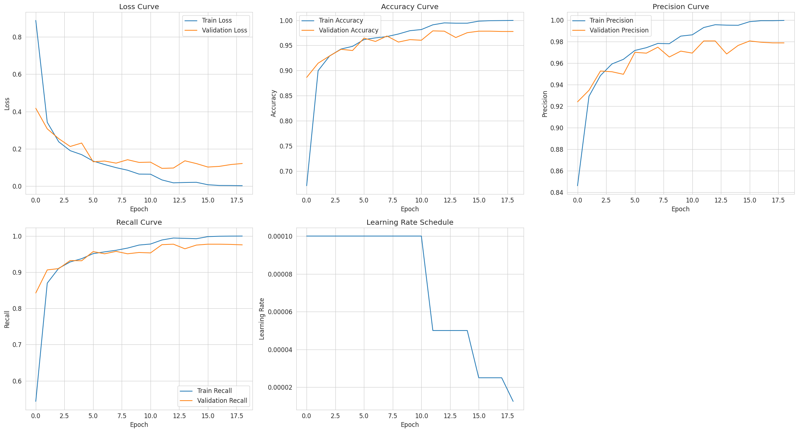
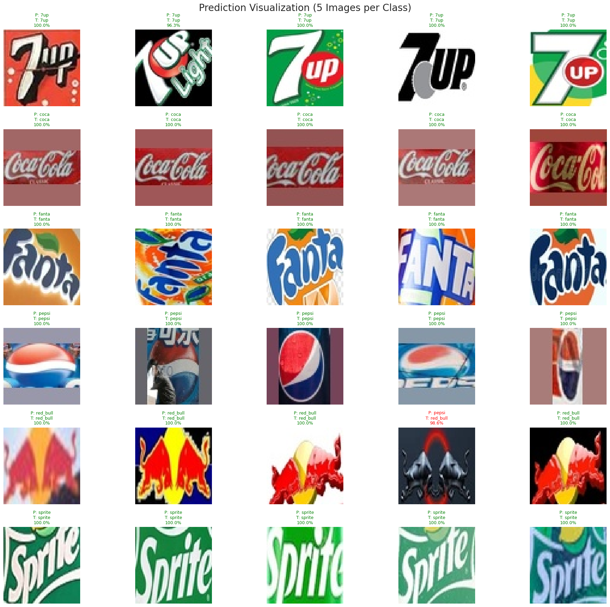
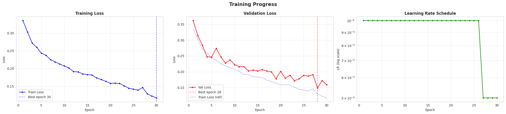
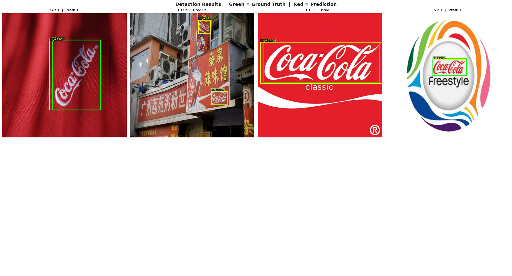
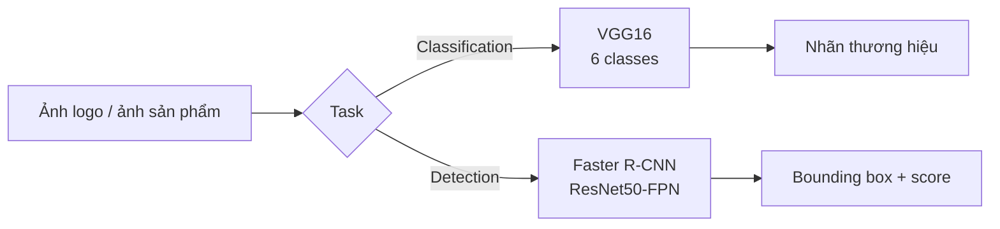

<div align="center">

# 🥤 DL Drink Logo

**Deep Learning pipeline cho nhận diện & phát hiện logo thương hiệu nước giải khát**

[](https://www.python.org/)
[](https://www.tensorflow.org/)
[](https://pytorch.org/)
[](https://jupyter.org/)
[](https://colab.research.google.com/)
[](https://github.com/starduong/DL_Drink_Logo)
[](#)

[Giới thiệu](#-giới-thiệu) ·
[Tính năng](#-tính-năng) ·
[Kết quả nhanh](#-kết-quả-nhanh) ·
[Dataset](#-dataset) ·
[Cấu trúc](#-cấu-trúc-dự-án) ·
[Cài đặt](#-cài-đặt) ·
[Hướng dẫn](#-hướng-dẫn-sử-dụng) ·
[Đánh giá](#-đánh-giá-mô-hình) ·
[Thu thập dữ liệu](#-thu-thập-dữ-liệu) ·
[Đóng góp](#-đóng-góp)

</div>

---

## 📑 Mục lục

| #   | Nội dung                               | Liên kết                                   |
| --- | -------------------------------------- | ------------------------------------------ |
| 1   | Giới thiệu                             | [#-giới-thiệu](#-giới-thiệu)               |
| 2   | Tính năng                              | [#-tính-năng](#-tính-năng)                 |
| 3   | Kết quả nhanh (Demo & Learning Curves) | [#-kết-quả-nhanh](#-kết-quả-nhanh)         |
| 4   | Dataset                                | [#-dataset](#-dataset)                     |
| 5   | Cấu trúc dự án                         | [#-cấu-trúc-dự-án](#-cấu-trúc-dự-án)       |
| 6   | Cài đặt                                | [#-cài-đặt](#-cài-đặt)                     |
| 7   | Hướng dẫn sử dụng                      | [#-hướng-dẫn-sử-dụng](#-hướng-dẫn-sử-dụng) |
| 8   | Đánh giá mô hình                       | [#-đánh-giá-mô-hình](#-đánh-giá-mô-hình)   |
| 9   | Thu thập dữ liệu                       | [#-thu-thập-dữ-liệu](#-thu-thập-dữ-liệu)   |
| 10  | Đóng góp                               | [#-đóng-góp](#-đóng-góp)                   |

---

## 🎯 Giới thiệu

**DL Drink Logo** là dự án Deep Learning end-to-end xử lý **logo thương hiệu đồ uống** qua hai bài toán bổ trợ nhau:

| Task       | Bài toán                                 | Mô hình                    | Framework             |
| ---------- | ---------------------------------------- | -------------------------- | --------------------- |
| **Task 1** | Phân loại thương hiệu (6 classes)        | VGG16 (train from scratch) | TensorFlow / Keras    |
| **Task 2** | Phát hiện vị trí logo (Object Detection) | Faster R-CNN ResNet50-FPN  | PyTorch / TorchVision |

Pipeline gồm: **thu thập ảnh** → **phân tích EDA** → **huấn luyện** → **đánh giá định lượng** → **trực quan hóa** (learning curves, confusion matrix, detection grid, inference ảnh ngoài tập).

> Cả hai mô hình đều được huấn luyện **không dùng pretrained weights** (`weights=None`) để đánh giá khả năng học từ đầu trên domain logo nước giải khát.

---

## ✨ Tính năng

- **Task 1 — Classification**
  - 6 nhãn: `7up`, `coca`, `fanta`, `pepsi`, `red_bull`, `sprite`
  - VGG16 + AdamW, callbacks (EarlyStopping, ReduceLROnPlateau, ModelCheckpoint)
  - Báo cáo: accuracy, precision, recall, F1, confusion matrix, per-class metrics

- **Task 2 — Detection**
  - Pascal VOC XML, class `logo` (background + logo)
  - Faster R-CNN + Albumentations augmentation
  - Mixed precision, gradient clipping, custom training loop
  - Metrics: mAP@50, mAP@[50:95], IoU, GT vs Prediction visualization

- **Data pipeline**
  - Script crawl logo đa nguồn (DuckDuckGo, Selenium)
  - Notebook phân tích dataset riêng cho từng task

---

## 🖼️ Kết quả nhanh

Phần dưới giúp người xem nắm kết quả **ngay trên README** mà không cần mở notebook.

### Task 1 — VGG16 Brand Classification

<table>
<tr>
<td width="50%">

**Learning Curves** — Loss, Accuracy, Learning Rate (30 epochs)



</td>
<td width="50%">

**Demo Predictions** — Lưới dự đoán (xanh = đúng, đỏ = sai)



</td>
</tr>
</table>

| Metric            | Giá trị            |
| ----------------- | ------------------ |
| Best Val Accuracy | **97.89%**         |
| Test Accuracy     | **96.95%**         |
| Test F1-Score     | **96.95%**         |
| Tham số           | 15,766,854         |
| Thời gian train   | ~7 phút (Colab T4) |

📓 Notebook: [`classification/VGG16_drink_logo_classify.ipynb`](classification/VGG16_drink_logo_classify.ipynb)

---

### Task 2 — Faster R-CNN Logo Detection

<table>
<tr>
<td width="50%">

**Learning Curves** — Train/Val Loss & LR Schedule



</td>
<td width="50%">

**Demo Detections** — Ground Truth (xanh lá) vs Prediction (đỏ)



</td>
</tr>
</table>

| Metric          | Giá trị              |
| --------------- | -------------------- |
| Best Val Loss   | **0.1488**           |
| mAP@50          | **92.48%**           |
| mAP@[50:95]     | **61.72%**           |
| Tham số         | 41,352,281           |
| Thời gian train | ~164 phút (Colab T4) |

📓 Notebook: [`detection/FastRCNN_drink_logo_detection.ipynb`](detection/FastRCNN_drink_logo_detection.ipynb)

---

## 📊 Dataset

Dataset gốc: **`dataset_drink_brand_logo`** (tách riêng cho classification và detection).

### Classification — 6 thương hiệu

| Class    |     Train |       Val |      Test |      Total |
| -------- | --------: | --------: | --------: | ---------: |
| 7up      |       918 |       196 |       198 |      1,312 |
| coca     |     2,515 |       539 |       540 |      3,594 |
| fanta    |     1,029 |       220 |       221 |      1,470 |
| pepsi    |     1,679 |       359 |       361 |      2,399 |
| red_bull |       840 |       180 |       180 |      1,200 |
| sprite   |       787 |       168 |       170 |      1,125 |
| **Tổng** | **7,768** | **1,662** | **1,670** | **11,100** |

- Kích thước ảnh: **64×64**
- Chuẩn hóa (mean RGB): `[0.575, 0.463, 0.458]` · std: `[0.219, 0.206, 0.207]`

Cấu trúc thư mục:

```text
dataset_drink_brand_logo/classification/
├── train/   # 7up, coca, fanta, pepsi, red_bull, sprite
├── val/
└── test/
```

### Detection — Logo bounding boxes

| Thống kê            | Giá trị        |
| ------------------- | -------------- |
| Tổng ảnh            | 2,980          |
| Tổng object (logo)  | 5,995          |
| Trung bình logo/ảnh | 2.01           |
| Kích thước ảnh      | 640×640        |
| Định dạng nhãn      | Pascal VOC XML |

```text
dataset_drink_brand_logo/detection/
├── images/
├── annotations/     # *.xml
├── splits/
│   ├── train.txt
│   ├── val.txt
│   └── test.txt
└── meta.txt
```

Mapping: `images/<name>.jpg` ↔ `annotations/<name>.xml`

---

## 📁 Cấu trúc dự án

```text
DL_drink_logo/
├── README.md
├── crawl_image_logo.py              # Thu thập ảnh logo từ web
├── docs/
│   └── assets/                      # Ảnh demo & learning curves cho README
│       ├── classification/
│       │   ├── learning_curves.png
│       │   └── demo_predictions.png
│       └── detection/
│           ├── learning_curves.png
│           └── demo_predictions.png
├── classification/
│   ├── VGG16_drink_logo_classify.ipynb
│   ├── dataset_analysis_classify.ipynb
│   └── PROMPT.txt
└── detection/
    ├── FastRCNN_drink_logo_detection.ipynb
    ├── dataset_analysis_detection.ipynb
    └── PROMPT.txt
```

---

## ⚙️ Cài đặt

### Yêu cầu

- Python ≥ 3.10
- GPU khuyến nghị (CUDA) cho detection; classification chạy được trên Colab T4
- Dataset `dataset_drink_brand_logo` (mount Google Drive hoặc giải nén local)

### Dependencies

**Task 1 — Classification**

```bash
pip install tensorflow numpy pandas matplotlib seaborn scikit-learn opencv-python pillow
```

**Task 2 — Detection**

```bash
pip install torch torchvision albumentations opencv-python numpy pandas matplotlib seaborn scikit-learn tqdm
```

**Thu thập dữ liệu (tùy chọn)**

```bash
pip install requests pillow imagehash tqdm duckduckgo-search selenium
```

### Clone repository

```bash
git clone https://github.com/starduong/DL_Drink_Logo.git
cd DL_Drink_Logo
```

---

## 🚀 Hướng dẫn sử dụng

### 1. Phân tích dataset (EDA)

```text
classification/dataset_analysis_classify.ipynb   # Phân bố class, thống kê ảnh
detection/dataset_analysis_detection.ipynb       # Bbox, object distribution
```

### 2. Huấn luyện Task 1 — VGG16

1. Mở [`classification/VGG16_drink_logo_classify.ipynb`](classification/VGG16_drink_logo_classify.ipynb) trên **Google Colab** hoặc Jupyter local.
2. Mount Drive / đặt đường dẫn dataset:

```python
DATASET_PATH = "/content/dataset_drink_brand_logo/classification"
```

3. Chạy toàn bộ notebook → checkpoint: `best_model_VGG16`.

**Cấu hình chính:** AdamW `lr=1e-4` · 30 epochs · `CategoricalCrossentropy` · không pretrained.

### 3. Huấn luyện Task 2 — Faster R-CNN

1. Mở [`detection/FastRCNN_drink_logo_detection.ipynb`](detection/FastRCNN_drink_logo_detection.ipynb).
2. Cấu hình đường dẫn:

```python
DATASET_PATH = "/content/dataset_drink_brand_logo/detection"
```

3. Chạy end-to-end → weights: `best_fasterrcnn_logo_detector.pth`.

**Cấu hình chính:** `fasterrcnn_resnet50_fpn` · `weights=None` · `weights_backbone=None` · AdamW · mixed precision.

### 4. Inference ảnh tùy ý

Cuối mỗi notebook có cell inference ảnh ngoài tập — upload ảnh và xem dự đoán / bounding box kèm confidence.

---

## 📈 Đánh giá mô hình

### Task 1 — Classification (Test set)

| Metric            |  Score |
| ----------------- | -----: |
| Accuracy          | 96.95% |
| Precision (macro) | 97.41% |
| Recall (macro)    | 96.77% |
| F1-Score          | 96.95% |

Bổ sung trong notebook: classification report, confusion matrix (raw & normalized), bar chart precision/recall/F1 theo class, final summary dashboard.

### Task 2 — Detection (Test set)

| Metric        |  Score |
| ------------- | -----: |
| mAP@50        | 92.48% |
| mAP@[50:95]   | 61.72% |
| Best Val Loss | 0.1488 |

Bổ sung: phân phối confidence & IoU, detection count/image, custom image inference với `CONFIDENCE_THRESHOLD`.

---

## 🕷️ Thu thập dữ liệu

Script [`crawl_image_logo.py`](crawl_image_logo.py) hỗ trợ crawl logo đa thương hiệu từ DuckDuckGo và Google (Selenium), với:

- Lọc trùng perceptual hash (`imagehash`)
- Kiểm tra kích thước tối thiểu
- Metadata CSV + logging
- Đa luồng tải ảnh

```bash
python crawl_image_logo.py
```

Output mặc định: thư mục `logo_dataset_drink_v5/` (cấu hình trong class `Config`).

---

## 🧠 Kiến trúc & phương pháp



| Khía cạnh             | Task 1                               | Task 2                                 |
| --------------------- | ------------------------------------ | -------------------------------------- |
| Input size            | 64×64                                | 640×640 (resize + aug)                 |
| Classes               | 6 brands                             | 1 (`logo`) + background                |
| Pretrained            | ❌                                   | ❌                                     |
| Optimizer             | AdamW                                | AdamW                                  |
| Callbacks / Scheduler | EarlyStopping, ReduceLR, Checkpoint  | Best-model save, LR schedule           |
| Visualization         | Learning curves, CM, prediction grid | Learning curves, GT vs Pred, analytics |

---

## 🤝 Đóng góp

1. Fork repository
2. Tạo branch: `git checkout -b feature/ten-tinh-nang`
3. Commit thay đổi và mở Pull Request

Gợi ý cải tiến: thêm brand classes, fine-tune với pretrained backbone, export ONNX/TFLite, API inference.

---

## 📎 Tài liệu tham khảo

- [VGG — Very Deep Convolutional Networks (Simonyan & Zisserman, 2014)](https://arxiv.org/abs/1409.1556)
- [Faster R-CNN (Ren et al., 2015)](https://arxiv.org/abs/1506.01497)
- [TensorFlow Keras VGG16](https://keras.io/api/applications/vgg/#vgg16-function)
- [TorchVision Detection Models](https://pytorch.org/vision/stable/models.html#object-detection)

---

<div align="center">

**DL Drink Logo** — Nhận diện thương hiệu & phát hiện logo nước giải khát bằng Deep Learning

Made with ❤️ for star duong

</div>
